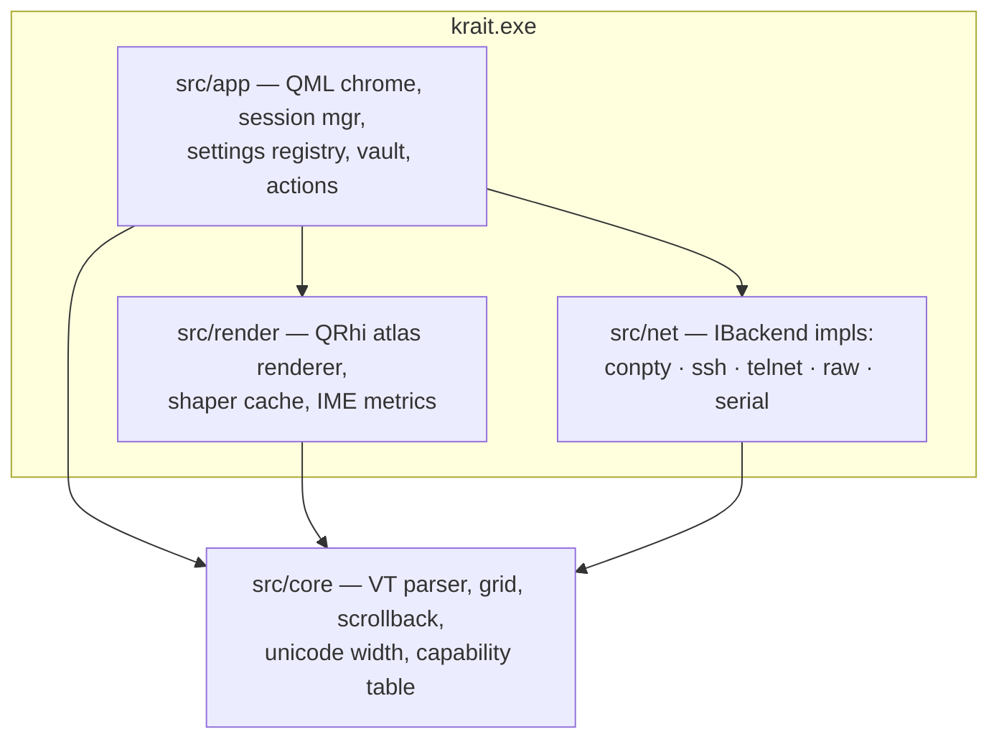
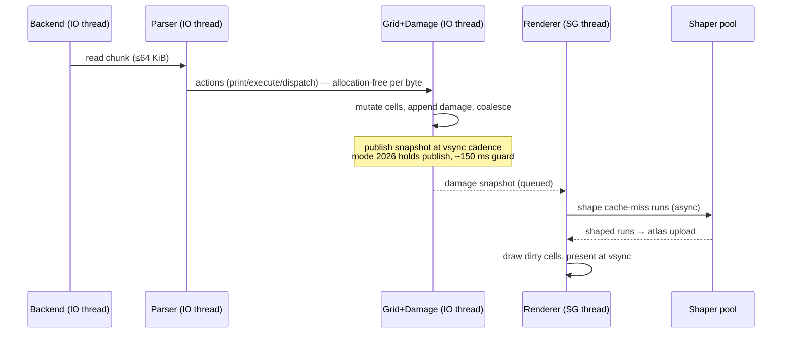
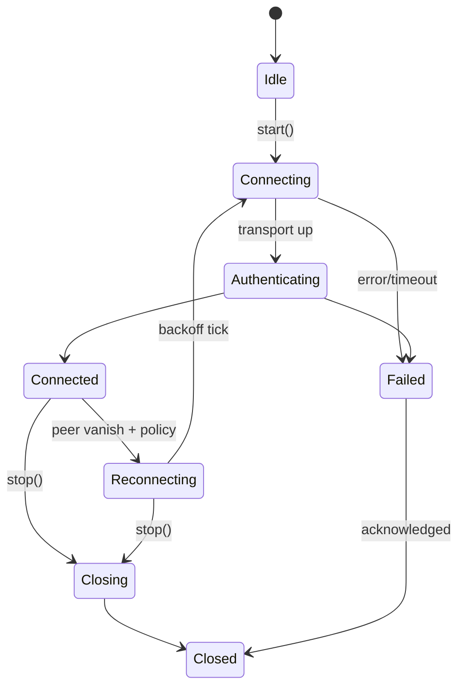

# Krait Architecture

Approved 2026-07-29. API facts below are verified — see Appendix A
(claim → source → confirmed). Stack is locked by ADR-0001/0002/0003;
this doc adds structure, not new stack decisions.

## 1. Module graph



| Module | May include | Must never include | Enforced by |
|---|---|---|---|
| `src/core` | STL, utf8proc | Qt, sockets, Win32, render, {fmt} in headers | standalone `krait-core` target + include audit (CI) |
| `src/net` | core headers, libssh, Win32, Qt (QObject signals only) | render, QML | review + include audit |
| `src/render` | core headers (read-only grid snapshots), Qt Gui/Quick, HarfBuzz, FreeType, DirectWrite | libssh, sockets | include audit |
| `src/app` | everything above | — | — |

Arrows point inward to `core` only. `net` and `render` never include each
other; they meet in `app` wiring.

## 2. Threads: ownership and seams

| Thread | Owns | Talks to (mechanism) | Lifetime |
|---|---|---|---|
| UI (Qt main) | QML scene, view-models, session manager, settings registry, vault handles | everything via queued signals | app |
| SG render thread (Qt-managed) | QQuickRhiItemRenderer state, QRhi resources, glyph atlas | UI thread only inside `synchronize()` (GUI thread blocked — verified) | window |
| Session IO (1 per tab) | backend handle (pipe/socket/ssh_session), **parser + grid + scrollback** | render: publishes immutable damage snapshot (queued); UI: state/banner events (queued); receives write/resize via bounded queue | tab |
| Shaper pool (N workers) | per-worker FT_Face instances (FT_Face is single-thread — verified), hb_font_t | render thread via job queue; results into shaper cache | app |

Rules (from `.claude/rules/cpp.md`): every wait has a timeout; threads named
at spawn; cross-thread Qt connections explicitly `Qt::QueuedConnection`;
shared data is immutable, message-passed, or behind a named mutex.

libssh constraint (verified): one session = one thread. The ssh backend's
session, channels, and `ssh_event_dopoll` loop all live on that tab's IO
thread. Dynamic linking ⇒ no `ssh_threads_set_callbacks` needed.

Parser+grid live on the IO thread — parsing mutates the grid directly with no
lock; the render side only ever sees published snapshots. The snapshot is the
single seam (row-versioned copy-on-write pages + damage list; cheap because
damage-bounded).

## 3. The byte's journey



**Backpressure story.** The grid is the accumulator: rendering cost is
O(visible screen), never O(bytes), because damage coalesces. So the parser is
allowed to run far ahead of the renderer — that is by design, not a leak. The
only bounded queue is IO→parser (fixed chunk pool). If grid mutation ever
stalls (it should not — it is the fastest stage), the pool empties, the read
loop stops reading, and the pipe/TCP window applies native backpressure to the
peer. Renderer slowness never blocks parsing; parser slowness throttles the
peer. Answerback rate-limiting (DSR/DA floods) sits in the parser's reply
path per `rules/net.md`.

## 4. IBackend contract

```cpp
// src/net/ibackend.h — sketch; final signatures land with T15
class IBackend : public QObject {
    Q_OBJECT
public:
    enum class State { Idle, Connecting, Authenticating, Connected,
                       Reconnecting, Closing, Closed, Failed };
    struct Caps { bool ptyResize; bool flowControl; bool reconnect; };

    virtual std::expected<void, ErrorCode> start(const Profile&) = 0;
    virtual void stop() = 0;                       // always non-blocking; cancels waits
    virtual void write(std::span<const std::byte>) = 0;   // enqueue to IO thread
    virtual void resize(int cols, int rows) = 0;
    virtual Caps caps() const = 0;
signals:
    void data(QByteArray chunk);                   // IO → parser feed
    void stateChanged(State, ErrorCode);           // drives per-tab banner
    void bell();
};
```



**Error taxonomy** (`ErrorCode`, one enum in `src/net/error.h`; every value
maps to a `tr()` banner string EN+TH, never a dialog):
`ConnectRefused, ConnectTimeout, DnsFailure, HostKeyUnknown, HostKeyChanged,
AuthFailed, AuthPartial, PeerClosed, IoError, TlsProtocolError, PtyFailure,
SerialGone, InternalBug`. Backends map native errors → taxonomy; the taxonomy
is the *contract*, tested per backend by the shared contract suite: connect,
auth flows, half-close, peer-vanish, flood, reconnect policy, error mapping
(`rules/net.md`).

## 5. Settings registry

One declarative table is the single source of truth (`rules/ui.md`):

```cpp
// src/app/settings/schema.h — one entry per setting, nothing else anywhere
Setting{ .id="terminal.font.size", .type=Int{6,72}, .def=12,
         .docKey="settings.font.size", .keywordsEn={"font","size"},
         .keywordsTh={"ฟอนต์","ขนาด"}, .migrate=nullptr }
```

Generated from it: TOML read/write (toml++, `TOML_EXCEPTIONS 0` — verified),
hot-reload diffing, the searchable settings QML model, command-palette
entries, docs stubs. Secrets never appear here — vault only (DPAPI),
referenced by opaque id. Adding a setting = `/add-setting`, which edits this
table and its satellites.

## 6. Directory layout (matches CLAUDE.md map)

```
src/core/     parser/ grid/ unicode/ caps/     — pure C++23 + utf8proc
src/net/      conpty/ ssh/ telnet/ raw/ serial/ ibackend.h error.h
src/render/   atlas/ shaper/ shaders/ (qsb via qt_add_shaders)
src/app/      qml/ settings/ sessions/ vault/ actions/ main.cpp
tests/        unit/ corpus/ contract/ fuzz/
bench/        baselines/
third_party/  openconsole/  (OpenConsole.exe + conpty.dll + MS LICENSE — ADR-0011)
docs/         decisions/ plan/ research/ conformance.md
```

## Appendix A — verification ledger (2026-07-29, five docs-verifier passes)

Legend: ✔ confirmed · ✔± confirmed with correction/caveat.

| Claim | Src | Confirmed |
|---|---|---|
| QRhi public since 6.6; QRhi/SwapChain/Buffer/Texture/GraphicsPipeline/ShaderResourceBindings/CommandBuffer | doc.qt.io/qt-6/qrhi.html | ✔ `<rhi/qrhi.h>`, link `Qt6::GuiPrivate`; **no source/binary compat guarantee** — pin Qt |
| D3D11 backend + selection | qrhi.html | ✔ `QRhiD3D11InitParams`; Quick: `QQuickWindow::setGraphicsApi()` early |
| QML embedding path | doc.qt.io/qt-6/qquickrhiitem.html | ✔ QQuickRhiItem since 6.7; `createRenderer()` → `initialize/synchronize/render`; **not functional on software SG backend** → WARP = D3D11 WARP adapter |
| QQuickFramebufferObject GL-only; RhiWindow not embeddable; QSGRenderNode footguns | qquickrhiitem.html, qsgrendernode.html, qtgui-rhiwindow-example.html | ✔ QQuickRhiItem is the supported path (ADR-0009) |
| qsb pipeline | doc.qt.io/qt-6/qtshadertools-build.html | ✔ `qt6_add_shaders()`, Vulkan-GLSL 440 → HLSL SM5.0; `PRECOMPILE` = fxc→DXBC |
| IME flow | qinputmethodevent.html, qquickitem.html | ✔ `ItemAcceptsInputMethod` + `inputMethodEvent()` + `inputMethodQuery(Qt::ImCursorRectangle)` + `updateInputMethod()` |
| Controls custom style | qtquickcontrols-customize.html | ✔ style = QML module dir; `QQuickStyle::setStyle` |
| SG threading | qtquick-visualcanvas-scenegraph.html | ✔ threaded loop default on Windows/D3D11; `synchronize()` runs on render thread with GUI blocked |
| windeployqt --qmldir | windows-deployment.html | ✔ qmlimportscanner; D3D compiler deps by default |
| Qt current = 6.11.1 (6.11.0 2026-03; 6.11.2 due 2026-08); 6.8 LTS patches commercial-only | qt.io/blog/qt-6.11.1-released | ✔± corrected from "6.10/6.11" |
| libssh session/channel/known_hosts/auth APIs | api.libssh.org/stable (session/channel/auth groups, guided tour) | ✔ names as used in this plan; `ssh_session_is_known_server` → `SSH_KNOWN_HOSTS_{OK,CHANGED,OTHER,UNKNOWN,NOT_FOUND,ERROR}` |
| libssh one-session-one-thread; no thread-callbacks needed when dynamic | api.libssh.org libssh_tutor_threads | ✔ |
| **ProxyJump native in-process since libssh 0.11.0** | libssh.org/2024/08/08/libssh-0-11-0-release, session options | ✔± ADR-0002's "shells out to ssh.exe" is stale → ADR-0012; `SSH_OPTIONS_PROXYJUMP` + per-hop `ssh_jump_callbacks_struct` |
| FIDO2 in libssh 0.12.0 via `ssh_pki_ctx` + `ssh_sk_callbacks` (+libfido2) | api.libssh.org/stable/libssh_tutor_fido2.html | ✔± mechanism is pki-ctx callbacks, not session callbacks |
| Windows agent: no native named-pipe/Pageant; bridge via `ssh_set_agent_socket` | gitlab.com/libssh/libssh-mirror/-/issues/277 | ✔± M3 carries a pipe→socket bridge task |
| Port fwd: `ssh_channel_open_forward` / `listen_forward`+`accept_forward`; SOCKS is DIY | api.libssh.org channel group | ✔ |
| ssh_config subset via `ssh_options_parse_config`, call last | api.libssh.org session group | ✔ |
| libssh stable 0.12.2 (2026-07-28), LGPL-2.1 dynamic | libssh.org | ✔ vcpkg port at 0.12.0 |
| HarfBuzz loop + `hb_ft_font_create_referenced`; **no built-in fallback** — detect not-found glyph (default 0), re-shape run | harfbuzz.github.io/what-harfbuzz-doesnt-do.html + API docs | ✔ |
| FreeType `FT_LOAD_RENDER` → `slot->bitmap`; `FT_RENDER_MODE_SDF` since 2.11; **FT_Face single-thread-at-a-time** | freetype.org reference + CHANGES | ✔ per-worker faces in shaper pool |
| DirectWrite enumeration + `IDWriteFontFallback::MapCharacters` | learn.microsoft.com dwrite_2 | ✔ discovery/fallback only, per ADR-0001 |
| utf8proc 2.11.3, Unicode 17; `utf8proc_grapheme_break_stateful` | github.com/juliastrings/utf8proc | ✔ `charwidth` is per-codepoint → input only to cluster logic |
| toml++ 3.4 `parse_file` → `parse_result` with `TOML_EXCEPTIONS 0`; `<<` serialize | marzer/tomlplusplus docs | ✔ |
| ConPTY: `CreatePseudoConsole/Resize/Close`, `PROC_THREAD_ATTRIBUTE_PSEUDOCONSOLE`, per-pipe threads | learn.microsoft.com/windows/console | ✔ since Win10 1809 (floor is 22H2, ADR-0006) |
| OpenConsole bundling: microsoft/terminal MIT; WezTerm ships `OpenConsole.exe`+`conpty.dll` | github.com/microsoft/terminal LICENSE; wezterm assets/windows/conhost | ✔ obligation: ship MS copyright + MIT text (ADR-0011) |
| DCS passthrough fixed in bundled OpenConsole ~v1.22 | microsoft/terminal#17313 → PR #17510 | ✔ pin build ≥ that fix |
| win32-input-mode `CSI ? 9001 h/l`; `CSI Vk;Sc;Uc;Kd;Cs;Rc _` | microsoft/terminal doc/specs/#4999 | ✔ |
| Paul Williams machine: 14 states / 14 actions verbatim | vt100.net/emu/dec_ansi_parser | ✔ deviations documented: UTF-8 outside machine; accept 0x3A subparams; C1 configurable; 16-param cap is DEC-ism |
| xterm ctlseqs live (Patch #410) | invisible-island.net/xterm/ctlseqs | ✔ |
| **vttest BSD** (corpus derivation OK); **esctest GPL-2.0** (external runner only) | invisible-island.net/vttest; github.com/gnachman/esctest | ✔± license boundary in ADR-0005 |
| kitty keyboard/graphics specs canonical | sw.kovidgoyal.net/kitty | ✔ |
| vcpkg ports: libssh 0.12.0 · harfbuzz 14.2.1 · freetype 2.14.3 · utf8proc 2.11.3 · tomlplusplus 3.4.0 · fmt 12.2.0 · catch2 3.15.3 · libfido2 1.17.0 · benchmark 1.9.5 | github.com/microsoft/vcpkg ports | ✔ |
| MSVC `/fsanitize=fuzzer` experimental; ASan supported; combine = both flags; ASan excludes /RTC, incremental link, coroutines | learn.microsoft.com /fsanitize | ✔ clang-cl primary for fuzz (ADR-0010) |
| GH Actions windows-latest = Server 2025 + VS2026 18.4 | github.com/actions/runner-images#14017 | ✔ |
| winget: manifest PR; exe OK at stable URL; silent install mandatory; unsigned risks rejection | learn.microsoft.com winget docs | ✔ signing cert before 1.0 (ADR-0007) |
| NSIS 3.12 (2026-04) maintained; WiX v6 stable | nsis.sourceforge.io; firegiant.com | ✔ |
